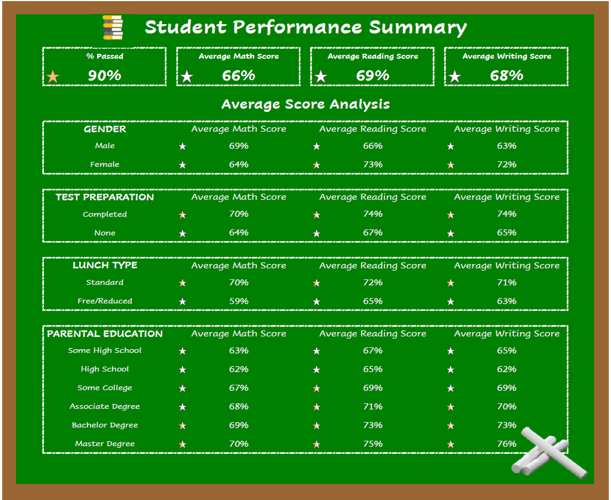

# Dashboard for Data Analysis and Visualization using MS Excel

Dataset: [Student Performance Data](data/Dataset_Student_Performance.csv)

## Objectives

To create a dashboard that summarizes the analysis of student performance during a previous test.

Questions to be answered:

1. Number/Percentage of students who passed/failed
2. Overall average scores across subjects being tested for
3. Compare student performance vs gender/parental level of education/lunch/test preparation
4. Summary statistics

### Data Cleaning and Transformation

**Step 1 - Convert dataset format from CSV to XLSX**

The original dataset is saved in XLSX format, to (1) preserve the integrity of the raw data and (2) ensure that all changes will be saved.

**Step 2 - Clean data**

Format header row to make it distinguishable from the rest of the data (suggest making the font bold and adding a cell fill). You can also freeze the header row to keep it visible while you scroll down the file. Add filters to the data (Ctrl/Cmd + Shift + L) to see the unique values in each column. Check for null values.

Make adjustments to make the data easier to view (i.e. center-aligning, adjusting column widths, etc.)

### Data Analysis & Dashboard Creation

**Step 1 - Create New Columns for Analysis Results**

We will need the following information:

- average score for each student
- indication of "pass/fail" for each student
- letter grade for each student

Obtain the average score for each student by using the formula for average and round it up as well for a cleaner presentation (=ROUND(AVERAGE(E2:G2),0)).

Using the "IF" formula, determine whether the student's average score qualifies as a "pass" or "fail" (=IF(H2>=50,"Pass","Fail")).

For the letter grade, we can use "IFS" formula to give each student a corresponding letter grade(=IFS(H2>=80,"A",H2>=70,"B",H2>=60,"C",H2>=50,"D",H2<50,"F")).

Use the fill handle to populate the other rows.

For a quick visual inspection, I added a conditional formatting using icon sets on all the numerical values on the "Data" worksheet.

**Step 2 - Generate Report/Dashboard**

Create a new worksheet and rename it to "Report"/"Dashboard" or whatever you may prefer.

The format/final output for the dashboard is as follows:

## Contact

Email: [may.lacdao@gmail.com]

Linkedin: [Connect with me!](https://www.linkedin.com/in/maylacdao/)
